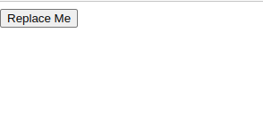
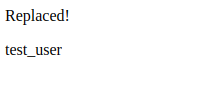

Basic Tutorial
--------------

Objective
~~~~~~~~~

In this tutorial, you'll learn how to use `hx_requests` to enhance interactions between Django views and Htmx.
We will create a simple example where a button click triggers an Htmx request that replaces the button with a string.
This example serves as a basic introduction to `hx_requests`, illustrating how it simplifies Htmx integration in Django.

Step 1: Installation
~~~~~~~~~~~~~~~~~~~~

First, add Htmx to your :code:`base.html` template.

.. code-block:: html

    <html>
        <head>
            
        </head>
        <body>
        </body>
    </html>

Next, install :code:`hx_requests`

::

    pip install hx-requests

    OR

    poetry add hx-requests

Finally, add :code:`hx_requests` to your :code:`settings.py`.

::

    INSTALLED_APPS = (
        ...
        'hx_requests',
    )

Step 2: Create The View
~~~~~~~~~~~~~~~~~~~~~~~

.. code-block:: python

    from hx_requests.views import HtmxViewMixin
    from django.views.generic.base import TemplateView

    class MyView(HtmxViewMixin, TemplateView):
        # For this tutorial, we will use base.html
        template_name = 'base.html'

Notes:
    - The view inherits from HtmxViewMixin which enables :code:`hx_requests` to work

Step 3: Add a URL
~~~~~~~~~~~~~~~~~

.. code-block:: python

    from django.urls import path
    from .views import MyView

    urlpatterns = [
        path('my_view/', MyView.as_view(), name='my_view'),
    ]

Step 4: Update The Template
~~~~~~~~~~~~~~~~~~~~~~~~~~~

Next, update the base.html template to include a button that will trigger the Htmx request:

.. code-block:: html+django

    
    <html>
        <head>
            
        </head>
        <body>
            <button id="btn"  hx-target="#btn" hx-swap="outerHTML" >Replace Me</button>
        </body>
    </html>

Notes:
    - The button is using the :code:`hx_get` template tag to make an Htmx request to an :code:`HxRequest` with the name
      :code:`replace_btn` (we will create this in step 6)

Go to :code:`/my_view` and you should see a button that looks like this:

Step 5: The content to swap in
~~~~~~~~~~~~~~~~~~~~~~~~~~~~~~

Create a new template file, `replaced.html`, which contains the content to swap in:

.. code-block:: html

    

        
Replaced!

    

Step 6: HxRequest
~~~~~~~~~~~~~~~~~

Create a new file, `hx_requests.py`, in the same directory as your views.py file.
This file will contain the :code:`HxRequest` class that will be used to swap in the content.

.. code-block:: python

    from hx_requests.hx_requests import BaseHxRequest

    class ReplaceBtn(BaseHxRequest):
        name = "replace_btn"
        GET_template = "replaced.html"

Notes:
    - The :code:`name` attribute must match the name used in the template (:code:`replace_btn`).
    - The :code:`GET_template` specifies the template that will be swapped in when the request is made

Go click the button and you should see the button replaced with the content from :code:`replaced.html`:

Stesp 7: Add Context (Optional)
~~~~~~~~~~~~~~~~~~~~~~~~~~~~~~~

What if you want to pass context to the template that is being swapped in? You can do this by overriding the :code:`get_context_data` method in the :code:`HxRequest`.

.. code-block:: python

    from hx_requests.hx_requests import BaseHxRequest
    from django.contrib.auth import get_user_model

    class ReplaceBtn(BaseHxRequest):
        name = "replace_btn"
        GET_template = "replaced.html"

        def get_context_data(self, **kwargs):
            context = super().get_context_data(**kwargs)
            context["user"] = get_user_model().objects.get_or_create(username="test_user", email="test@test.com")
            return context

Update the template to use the context:

.. code-block:: html+django

    

        
Replaced!

        
{{ user.username }}

    

Now when you click the button, you should see the username of the user in the content:

Step 8: Use Blocks (Optional)
~~~~~~~~~~~~~~~~~~~~~~~~~~~~~

What if you only want to swap some in some of the content from the template? You can do this by using blocks in the template and setting the block on the :code:`HxRequest`.

.. code-block:: html+django

    
        

            
Replaced!

        

    

    
        Lots of other important content...
    

.. code-block:: python

        from hx_requests.hx_requests import BaseHxRequest

        class ReplaceBtn(BaseHxRequest):
            name = "replace_btn"
            GET_template = "replaced.html"
            blocks = "content" # This will only swap in the content block
