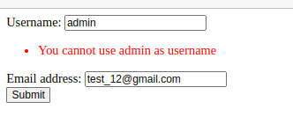

Form Tutorial
-------------

Objective
~~~~~~~~~

In this tutorial, you'll learn how to use hx_requests with forms by building a simple user form that is swapped in and replaces the
user's info display, and submits data via an HTMX request, dynamically updating both the user and the user info display. We'll also cover
handling form validation and displaying error :ref:`messages <How To Use Messages>` using hx_requests. Additionally, we'll take a more advanced approach by utilizing
template blocks to update content efficiently, eliminating the need for a separate template.

Step 1: Installation
~~~~~~~~~~~~~~~~~~~~

First, add Htmx to your :code:`base.html` template.

.. code-block:: html

    <html>
        <head>
            
        </head>
        <body>
        </body>
    </html>

Next, install :code:`hx_requests`

::

    pip install hx-requests

    OR

    poetry add hx-requests

Finally, add :code:`hx_requests` to your :code:`settings.py`.

::

    INSTALLED_APPS = (
        ...
        'hx_requests',
    )

Step 2: Create The View
~~~~~~~~~~~~~~~~~~~~~~~

.. code-block:: python

    from hx_requests.views import HtmxViewMixin
    from django.views.generic.edit import UpdateView
    from django.contrib.auth import get_user_model

    class MyFormView(HtmxViewMixin, UpdateView):
        # For this tutorial, we will use base.html
        template_name = 'base.html'

        def get_object(self, queryset=None):
            obj, _ = get_user_model().objects.get_or_create(pk=1, defaults={"username": "default_user", "email": "default_user@email.com"})
            return obj

Notes:
    - The view inherits from HtmxViewMixin, which enables :code:`hx_requests` to work

Step 3: Add a URL
~~~~~~~~~~~~~~~~~

.. code-block:: python

    from django.urls import path
    from .views import MyFormView

    urlpatterns = [
        path('my_form_view/<int:user_id>', MyFormView.as_view(), name='my_form_view'),
    ]

Step 4: Create The Form
~~~~~~~~~~~~~~~~~~~~~~~

.. code-block:: python

    from django import forms
    from django.contrib.auth import get_user_model

    class UserForm(forms.ModelForm):
        class Meta:
            model = get_user_model()
            fields = ['username', 'email']

Step 5: Add The Form To The View
~~~~~~~~~~~~~~~~~~~~~~~~~~~~~~~~

.. code-block:: python

    from .forms import UserForm

    class MyFormView(HtmxViewMixin, UpdateView):
        template_name = 'base.html'
        form_class = UserForm # Add the form to the view

        def get_object(self, queryset=None):
            obj, _ = get_user_model().objects.get_or_create(pk=1, defaults={"username": "default_user", "email": "default_user@email.com"})
            return obj

Step 6: Update base.html
~~~~~~~~~~~~~~~~~~~~~~~~

Next, update the base.html template to include a button that will trigger the Htmx request:

.. code-block:: html+django

    
    <html>
        <head>
            
        </head>
         <body>
            
                

                    
Username: {{ object.username }}

                    
Email: {{ object.email }}

                    <button  hx-target='#user-info'>Edit</button>
                

            
        </body>
    </html>

Notes:
    - The ::ref:`hx_get<Hx Tags>` template tag is used to make an Htmx request to the :code:`user_form_hx_request` HxRequest
    - The object in the context coming from the UpdateView is passed to the :ref:`hx_get<Hx Tags>` template tag as object

Go to :code:`/my_form_view/1` and you should see the user data that looks like this:

Step 7: Create The Form Template:
~~~~~~~~~~~~~~~~~~~~~~~~~~~~~~~~~

Add a template: user_form.html

.. code-block:: html+django

    
    <form  hx-target="#user-info">
        
        {{ form.as_p }}
        <button type="submit">Submit</button>
    </form>

Notes:
    - The form is using the :ref:`hx_post<Hx Tags>` template tag to make an Htmx request to an :code:`HxRequest` with the name
      :code:`user_form_hx_request` (we will create this in step 8)
    - The object in the context coming from the UpdateView is passed to the :ref:`hx_post<Hx Tags>` template tag as object

Step 8: Create The HxRequest
~~~~~~~~~~~~~~~~~~~~~~~~~~~~

Create a new file, `hx_requests.py`, in the same directory as your views.py file.

.. code-block:: python

    from hx_requests import FormHxRequest
    from .forms import UserForm

    class UserFormHxRequest(FormHxRequest):
        name = 'user_form_hx_request'
        GET_template = 'user_form.html' # This is the template to render when the form is requested
        POST_template = 'base.html' # This is the full template, but only a specific block is swapped
        POST_block = 'user_info_block' # This is the block to swap in from the POST_template
        form_class = UserForm
        hx_object_name = 'object' # This is the name of the object in the context of the POST_template

Notes:
    - The name attribute must match the name used in the template (user_form_hx_request).
    - The POST_template attribute specifies the template to render after a successful form submission, but only the defined block will be swapped in.
    - The POST_block attribute determines which block from the POST_template will be updated.
    - Using blocks allows you to reuse sections of a template without needing a separate file.
    - The hx_object_name is needed here so that in the POST_template, the object can be accessed by the same name as in the original template.

Go to :code:`/my_form_view/1` and click the Edit button. You should see the form displayed:

Edit the username and email fields and submit the form. You should see the user info updated:

Step 9: Handling Form Validation
~~~~~~~~~~~~~~~~~~~~~~~~~~~~~~~~

To handle form validation, update the :code:`UserForm` class to include a clean method that raises a validation error.

.. code-block:: python

    from django import forms
    from django.contrib.auth import get_user_model

    class UserForm(forms.ModelForm):
        class Meta:
            model = get_user_model()
            fields = ['username', 'email']

        def clean(self):
            cleaned_data = super().clean()
            if cleaned_data.get('username') == 'admin':
                self.add_error('username', 'Username cannot be admin')

            return cleaned_data

Update the user_form.html template to display the error message:

.. code-block:: html+django

    
    <form  hx-target="#user-info">
        
        
            

                {{ field.label_tag }}
                {{ field }}
            

            
                <ul>
                    
                        <li style='color:red'>{{ error }}</li>
                    
                </ul>
            
        
        <button type="submit">Submit</button>
    </form>

Go to :code:`/my_form_view/1` and submit the form with the username set to :code:`admin`. You should see the error message displayed.

